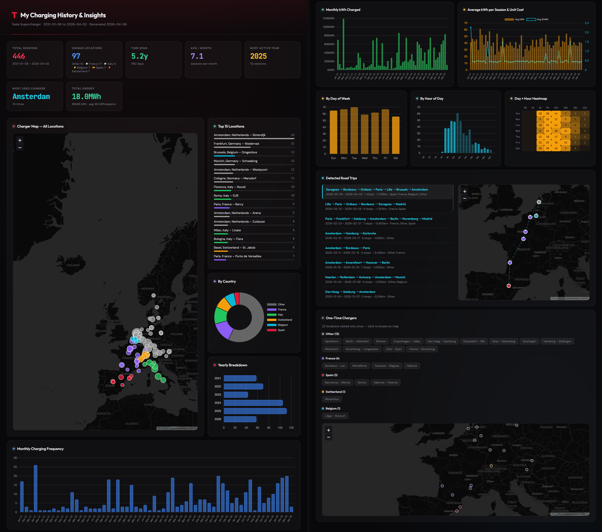

# Tesla Supercharger Analytics

Turn your Tesla charging history CSV into a beautiful, interactive dashboard — entirely local, no account required.



## Features

- Interactive map with all your Supercharger locations
- Charging frequency trends (monthly, yearly)
- Cost analysis (kWh, unit cost trends)
- Day-of-week and hour-of-day patterns
- Road trip detection and visualization
- Top locations ranking
- Country breakdown
- Works 100% offline — single HTML file output

## Quick Start

**Requirements:** Python 3.11+ (no pip install needed — uses only standard library)

### 1. Export your charging history from the Tesla app

1. Open the Tesla app
2. Tap the menu icon (three horizontal lines, top-right)
3. Tap **Charging**
4. Tap **History**
5. Tap the download icon (top-right), select a date range, and choose **CSV**

> **Note:** CSV export is available for charging sessions from 2022 onwards. Support for earlier history is in progress.

### 2. Generate your dashboard

```bash
python supercharger_analytics.py your-charging-history.csv
```

### 3. Open the dashboard

Open `charge_history.html` in your browser. That's it.

## Options

```bash
# Multiple CSV files
python supercharger_analytics.py file1.csv file2.csv file3.csv

# Custom output name
python supercharger_analytics.py *.csv -o my_dashboard

# Set timezone (match your Tesla app — default: Europe/London)
python supercharger_analytics.py *.csv --tz America/New_York
python supercharger_analytics.py *.csv --tz Europe/Berlin
python supercharger_analytics.py *.csv --tz Asia/Tokyo
```

## How It Works

1. Reads Tesla's official charging CSV exports
2. Fetches Supercharger coordinates from [supercharge.info](https://supercharge.info)
3. Generates a self-contained HTML dashboard with embedded data
4. No data leaves your machine — everything runs locally

## Adding New Data

Run the command again with new CSV files. Existing records are preserved and duplicates are automatically removed:

```bash
python supercharger_analytics.py new-export.csv
```

## Sample

See `sample/` for an example CSV and generated dashboard.

## License

MIT
